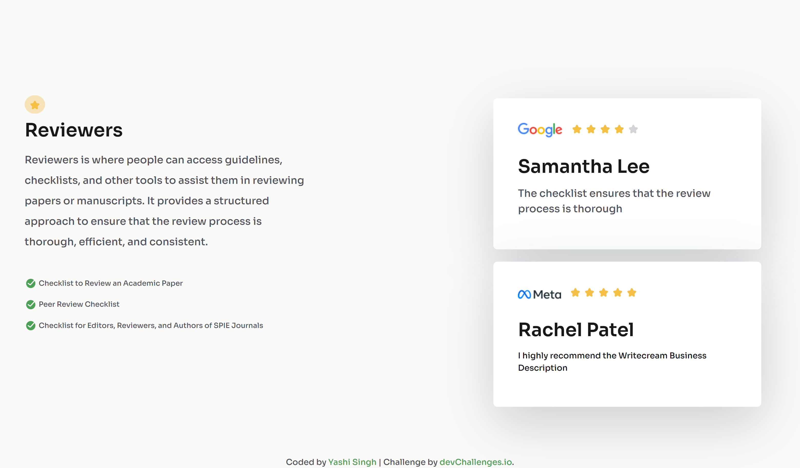

<h1 align="center">Reviewers Page | devChallenges</h1>

   Solution for a challenge <a href="https://devchallenges.io/challenge/testimonial-page" target="_blank">Testimonial Page</a> from <a href="http://devchallenges.io" target="_blank">devChallenges.io</a>.

  <h3>
    <a href="https://yashi-singh-9.github.io/Testimonial-Page/">
      Demo
    </a>
     | 
    <a href="https://devchallenges.io/solution/51408">
      Solution
    </a>
     | 
    <a href="https://devchallenges.io/challenge/testimonial-page">
      Challenge
    </a>
  </h3>

## Table of Contents

- [Overview](#overview)
  - [What I learned](#what-i-learned)
  - [Useful resources](#useful-resources)
- [Built with](#built-with)
- [Features](#features)
- [Contact](#contact)
- [Acknowledgements](#acknowledgements)

## Overview

This project is a responsive testimonial page designed for reviewers who want to access academic peer review tools, checklists, and guidelines. It demonstrates a clean layout using Flexbox and custom CSS variables for color theming. The page includes testimonial cards with star ratings and professional branding.

### What I learned

- How to structure a semantic HTML5 layout with clear sections.
- Using CSS custom properties (variables) to maintain consistent color theming.
- Creating responsive layouts using Flexbox and utility classes from Bootstrap.
- Incorporating external fonts from Google Fonts to improve typography.
- Adding accessible and descriptive alt attributes to images.
- Organizing assets like icons and images for a clean project structure.

### Useful resources

- [Google Fonts - Sora](https://fonts.google.com/specimen/Sora) - For the clean and modern font style.
- [Bootstrap 5 Documentation](https://getbootstrap.com/docs/5.3/getting-started/introduction/) - Used for utility classes and layout.
- [CSS Tricks - CSS Variables](https://css-tricks.com/a-complete-guide-to-custom-properties/) - Helped with managing colors via CSS variables.
- [DevChallenges.io](https://devchallenges.io) - The original challenge source and inspiration.

## Built with

- Semantic HTML5 markup
- CSS custom properties for theming
- Flexbox layout
- Bootstrap 5.3 for utilities and grid assistance
- Google Fonts (Sora)

## Features

- Clean, modern testimonial page layout
- Two-column responsive design
- Star rating visuals for testimonials
- Use of accessible and descriptive elements
- Footer with personal and challenge links

## Contact

- LinkedIn: [Yashi Singh](https://www.linkedin.com/in/yashi-singh-b4143a246)

## Acknowledgements

- Thanks to devChallenges.io for providing an excellent challenge framework.
- Inspiration from various CSS and design resources online.
